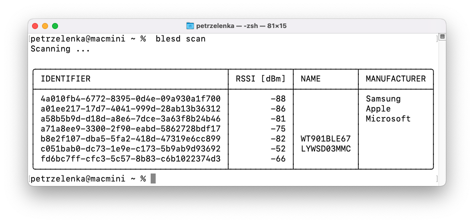
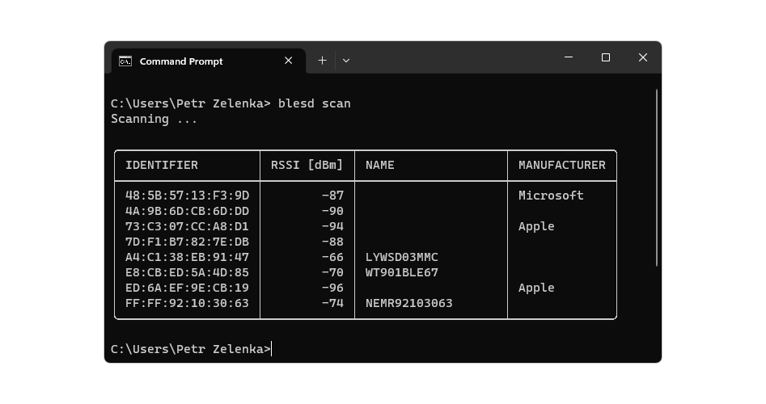
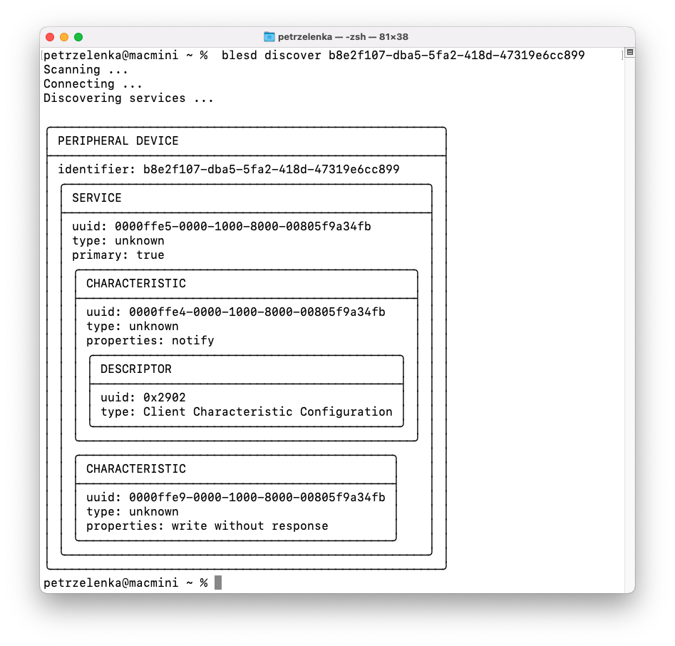
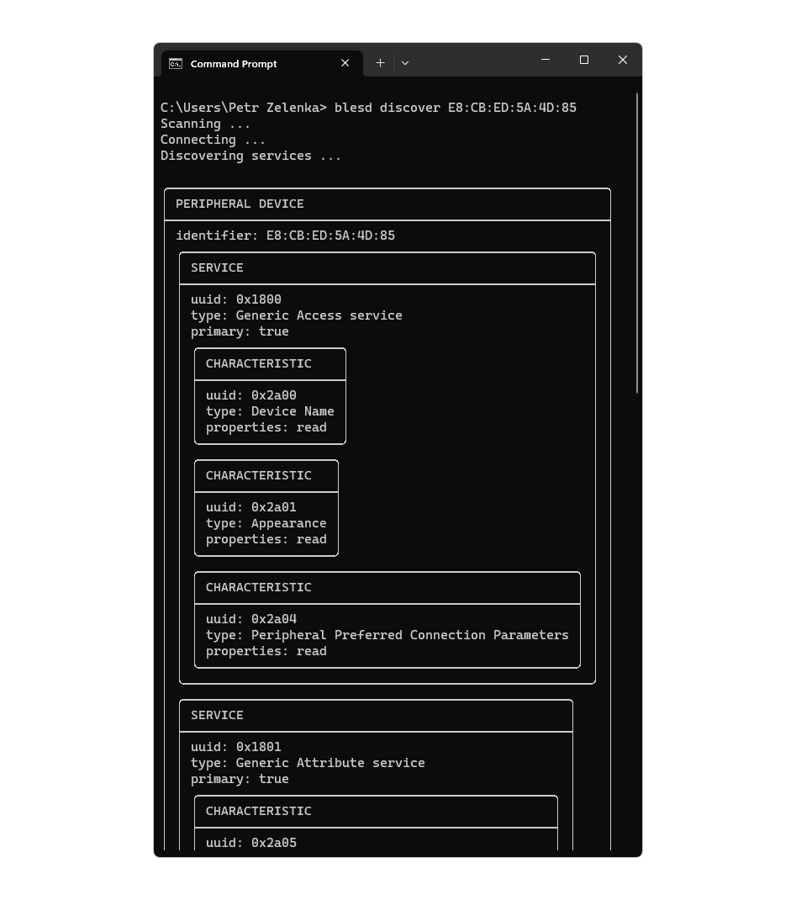

# blesd

Blesd is a command-line tool for discovering services and characteristics provided by Bluetooth LE peripheral devices.

## Installation

[Releases](releases) contain precompiled binaries for Windows (x86_64) and macOS (AArch64).
Just extract the binary from the respective archive and place it on `PATH`.

## Usage

To scan for peripheral devices, use the `blesd scan` command (for detailed information about the command parameters, use the `blesd help scan` command):

To discover the services and characteristics provided by a peripheral device, use the `blesd discover <DEVICE_IDENTIFIER>` command (for detailed information about the command parameters, use the `blesd help discover` command):

NOTE: There are fundamental differences in handling of Bluetooth LE devices across the operating systems, resulting in different device identifiers being used and slightly different discovered services being reported.
Blesd works exactly according to the internal rules on each operating system.
